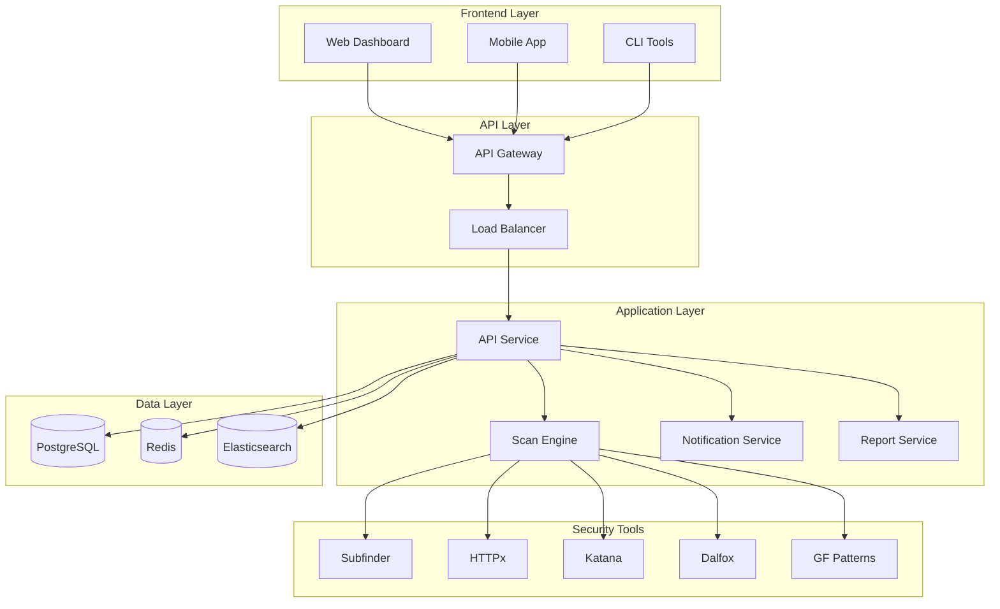

# SecureScope - Enterprise SECops Platform

<div align="center">


[](https://opensource.org/licenses/MIT)
[](https://docker.com)
[](https://kubernetes.io)
[](https://fastapi.tiangolo.com)
[](https://securescope.com)

**Transform your security operations with automated vulnerability discovery and management**

[🚀 Quick Start](#quick-start) • [📚 Documentation](#documentation) • [💼 Enterprise](#enterprise-features) • [🤝 Support](#support)

</div>

## 🌟 Overview

SecureScope is an enterprise-grade SECops platform that transforms the original Auto_xss script into a comprehensive security operations solution. Built for modern DevSecOps workflows, it provides automated vulnerability discovery, management, and reporting at scale.

### 🎯 Key Features

- **🔍 Automated Vulnerability Discovery**: Multi-tool integration for comprehensive security scanning
- **🏢 Enterprise-Ready**: Multi-tenant architecture with RBAC and SSO integration
- **📊 Advanced Analytics**: Real-time dashboards and compliance reporting
- **🔄 CI/CD Integration**: Native integration with popular DevOps tools
- **☁️ Cloud-Native**: Kubernetes-ready with auto-scaling capabilities
- **🛡️ Security-First**: Enterprise security controls and audit logging

## 🏗️ Architecture



## 🚀 Quick Start

### Option 1: Docker Compose (Recommended for Development)

```bash
# Clone the repository
git clone https://github.com/Addy-shetty/Auto_xss.git
cd Auto_xss

# Start the platform
docker-compose up -d

# Access the services
echo "🌐 API: http://localhost:8000"
echo "📊 Monitoring: http://localhost:3000 (admin/admin)"
echo "🌺 Flower: http://localhost:5555/flower"
echo "📈 Kibana: http://localhost:5601"
```

### Option 2: Kubernetes (Production)

```bash
# Install with Helm
helm repo add securescope https://charts.securescope.com
helm install securescope securescope/securescope

# Or deploy with kubectl
kubectl apply -f k8s/
```

### Option 3: Manual Installation

```bash
# Install dependencies
./Install_tools.sh

# Install Python requirements
pip install -r requirements.txt

# Configure environment
cp .env.example .env
vim .env

# Start the API server
python src/api/main.py
```

## 📚 Documentation

### Core Components

#### 🔧 Enhanced Scanning Engine
Evolution from simple bash script to enterprise-grade scanning:

```python
# Original bash workflow
./auto_xss.sh -d example.com

# New API-driven workflow
curl -X POST "http://localhost:8000/api/v1/scans" \
  -H "Content-Type: application/json" \
  -H "Authorization: Bearer $TOKEN" \
  -d '{
    "domain": "example.com",
    "scan_type": "comprehensive",
    "notify_email": "security@company.com"
  }'
```

#### 🛠️ Integrated Security Tools

| Tool | Purpose | Integration Level |
|------|---------|------------------|
| **Subfinder** | Subdomain Discovery | ✅ Containerized |
| **HTTPx** | Live Host Detection | ✅ API Integrated |
| **Katana** | URL Crawling | ✅ Async Processing |
| **Dalfox** | XSS Detection | ✅ Results Parsing |
| **GF Patterns** | Pattern Matching | ✅ Custom Rules |

#### 📊 Enterprise Features

- **Multi-Tenancy**: Organization-based isolation
- **RBAC**: Role-based access control
- **SSO Integration**: SAML/OIDC support
- **Audit Logging**: Comprehensive activity tracking
- **Compliance**: SOC2, ISO27001 ready
- **API Management**: Rate limiting, authentication
- **Reporting**: Custom dashboards and exports

## 💼 Enterprise Capabilities

### 🏢 Multi-Tenant Architecture

```yaml
# Organization Structure
organizations:
  - name: "Enterprise Corp"
    plan: "enterprise"
    domains: 1000
    users: 100
    features: ["sso", "audit", "compliance"]
  
  - name: "Startup Inc"
    plan: "professional"
    domains: 50
    users: 10
    features: ["api", "reporting"]
```

### 🔐 Security & Compliance

- **Data Encryption**: AES-256 at rest, TLS 1.3 in transit
- **Zero Trust**: Network segmentation and micro-segmentation
- **Compliance**: GDPR, CCPA, SOX compliance features
- **Audit Trail**: Immutable audit logs with digital signatures
- **Vulnerability Management**: CVE tracking and remediation workflows

### 📈 Scalability & Performance

- **Horizontal Scaling**: Auto-scaling Kubernetes deployments
- **Load Balancing**: Multi-region load distribution
- **Caching**: Redis-based result caching
- **Queue Management**: Celery-based background processing
- **Database Optimization**: Connection pooling and read replicas

## 🔌 Integrations

### DevOps & CI/CD

```yaml
# GitHub Actions Integration
- name: Security Scan
  uses: securescope/github-action@v1
  with:
    domain: ${{ github.event.repository.name }}
    api-key: ${{ secrets.SECURESCOPE_API_KEY }}
    wait-for-completion: true
```

### SIEM & Security Tools

- **Splunk**: Real-time event forwarding
- **QRadar**: Security intelligence integration
- **Sentinel**: Azure cloud SIEM connector
- **Elastic Security**: Direct Elasticsearch integration

### Ticketing & Communication

- **Jira**: Automatic ticket creation for vulnerabilities
- **ServiceNow**: IT service management integration
- **Slack/Teams**: Real-time notifications
- **PagerDuty**: Critical alert escalation

## 💰 Business Model & Monetization

### 📊 Subscription Tiers

| Plan | Price/Month | Domains | Users | Features |
|------|-------------|---------|-------|----------|
| **Starter** | $2,000 | 10 | 1 | Basic scanning, Email alerts |
| **Professional** | $8,000 | 100 | 5 | API access, Team collaboration |
| **Enterprise** | $25,000 | Unlimited | Unlimited | Full features, 24/7 support |
| **Enterprise Plus** | Custom | Custom | Custom | On-premises, Custom integrations |

### 🎯 Target Markets

1. **Enterprise Security Teams** (Primary)
   - Fortune 500 companies
   - $50K-$500K annual security budgets
   - Complex multi-domain environments

2. **Managed Security Providers** (Secondary)
   - MSSPs and penetration testing companies
   - Need for scalable automated testing
   - White-label and reseller opportunities

3. **DevSecOps Teams** (Tertiary)
   - High-growth technology companies
   - CI/CD security integration requirements
   - Shift-left security adoption

### 💼 Revenue Projections

- **Year 1**: $500K ARR (Foundation)
- **Year 2**: $2.5M ARR (Growth)
- **Year 3**: $8M ARR (Scale)
- **Year 4**: $20M ARR (Expansion)
- **Year 5**: $45M ARR (Market Leader)

## 🚀 Getting Started for Enterprises

### 1. Proof of Concept

```bash
# 30-day enterprise trial
docker run -d \
  -p 8000:8000 \
  -e TRIAL_MODE=true \
  -e ORGANIZATION=your-company \
  securescope/enterprise:latest
```

### 2. Professional Services

- **Implementation**: 3-6 month deployment
- **Training**: Administrator and user certification
- **Custom Integration**: API and SIEM connectors
- **Support**: 24/7 enterprise support with SLA

### 3. Deployment Options

- **SaaS**: Multi-tenant cloud deployment
- **Private Cloud**: Dedicated cloud instances
- **On-Premises**: Kubernetes or VM deployment
- **Hybrid**: Mixed cloud and on-premises

## 📈 Monitoring & Analytics

### 🎛️ Executive Dashboard

- **Security Posture**: Real-time vulnerability metrics
- **Compliance Status**: Regulatory compliance tracking
- **Risk Assessment**: Automated risk scoring
- **ROI Metrics**: Security investment effectiveness

### 🔍 Operational Metrics

- **Scan Performance**: Completion rates and timing
- **Tool Effectiveness**: Detection accuracy per tool
- **False Positive Rate**: Quality metrics
- **Coverage Analysis**: Asset discovery completeness

## 🛡️ Security & Compliance

### 🔒 Security Controls

- **Access Control**: Multi-factor authentication
- **Data Protection**: Field-level encryption
- **Network Security**: VPC and firewall rules
- **Container Security**: Runtime protection
- **Secrets Management**: HashiCorp Vault integration

### 📋 Compliance Features

- **SOC 2 Type II**: Security and availability controls
- **ISO 27001**: Information security management
- **GDPR**: Data protection and privacy
- **HIPAA**: Healthcare data security (add-on)
- **PCI DSS**: Payment card industry standards

## 🤝 Support & Community

### 📞 Enterprise Support

- **24/7 Support**: Critical issue resolution
- **Dedicated CSM**: Customer success management
- **Training Programs**: Administrator certification
- **Professional Services**: Implementation and consulting

### 🌐 Community Resources

- **Documentation**: [docs.securescope.com](https://docs.securescope.com)
- **Community Forum**: [community.securescope.com](https://community.securescope.com)
- **GitHub**: [github.com/securescope](https://github.com/securescope)
- **Blog**: [blog.securescope.com](https://blog.securescope.com)

### 🎓 Training & Certification

- **SecureScope Administrator**: $2,000
- **SecureScope Architect**: $3,500
- **Partner Certification**: Available for resellers
- **Custom Training**: On-site and virtual options

## 📄 License & Credits

### 📜 Licensing

- **Open Source Core**: MIT License (Community Edition)
- **Enterprise License**: Commercial license for enterprise features
- **Partner License**: Available for resellers and integrators

### 🙏 Credits & Acknowledgments

SecureScope builds upon the excellent work of the security community:

- **Original Auto_xss**: [Adwaith Shetty](https://github.com/Adwaithsheety)
- **Project Discovery**: Subfinder, HTTPx, Katana
- **Security Tools**: Dalfox, GF-Patterns, Waybackurls
- **Framework Contributors**: FastAPI, Celery, PostgreSQL

### 🌟 Contributing

We welcome contributions from the security community:

1. **Fork** the repository
2. **Create** your feature branch
3. **Commit** your changes
4. **Push** to the branch
5. **Create** a Pull Request

## 📞 Contact & Sales

### 💼 Enterprise Sales

- **Email**: sales@securescope.com
- **Phone**: +1 (555) 123-SECURE
- **Demo**: [schedule a demo](https://securescope.com/demo)

### 🛠️ Technical Support

- **Support Portal**: [support.securescope.com](https://support.securescope.com)
- **Email**: support@securescope.com
- **Emergency**: +1 (555) 911-SECURE (Enterprise customers)

### 🔒 Security Issues

- **Security Email**: security@securescope.com
- **Bug Bounty**: [securescope.com/bounty](https://securescope.com/bounty)
- **Responsible Disclosure**: 90-day coordinated disclosure

---

<div align="center">

**Transform your security operations today with SecureScope**

[🚀 Start Free Trial](https://securescope.com/trial) • [📞 Contact Sales](https://securescope.com/contact) • [📚 View Docs](https://docs.securescope.com)

Built with ❤️ by the SecureScope team

</div>
